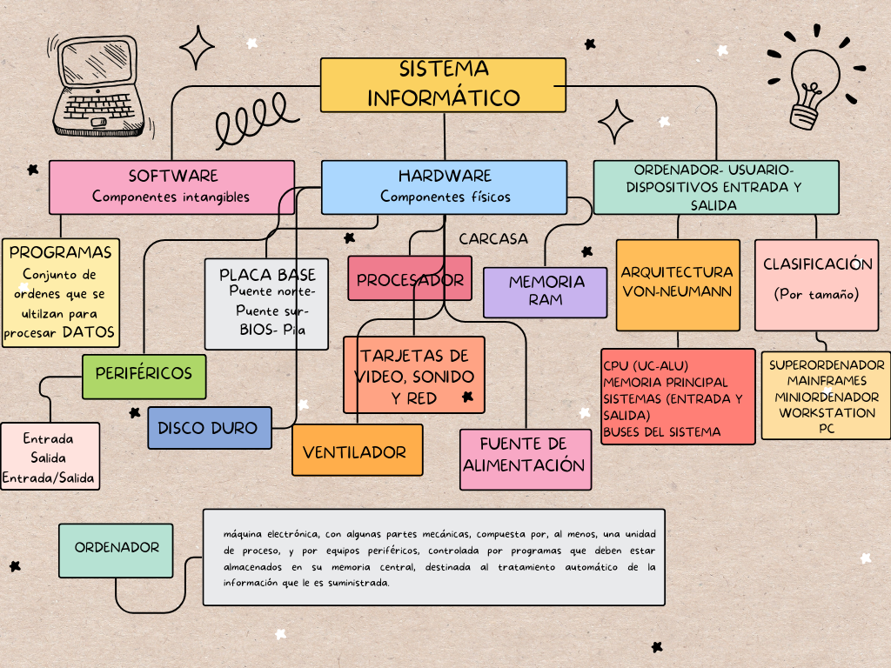

# SISTEMAS INFORMATICOS

## UNIDAD 1
- Hardware
  - Estructura **Von Neumann**
- Software

[Información de Wikipedia de Von Neumann](https://es.wikipedia.org/wiki/John_von_Neumann)

### Esquema



## UNIDAD 2

Git Hub

```cpp
int main(){
    cout << "hola mundo" << endl;
    }
```